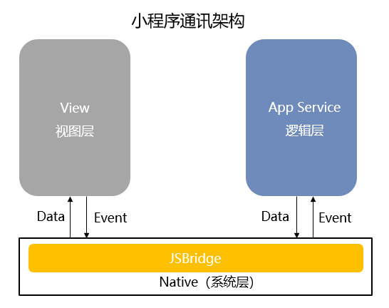
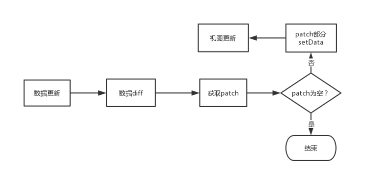

# miniprogram-diff - 小程序setData高性能diff算法

## 前言
小程序的视图层和逻辑层是两个独立的线程模块，并不具备数据直接共享的通道，双方的通讯需要经过底层的JSBridge，数据到达视图层并不是实时的。
  

- 频繁的执行setData，导致的后果：WebView JS线程一直在编译执行渲染，逻辑层到页面层的通讯耗时上升，导致渲染结果有延迟。
- 数据传输实际是一次 **evaluateJavascript** 脚本过程。当数据量过大时会增加脚本的编译执行时间，占用 WebView JS 线程。

## 目的
解决小程序内因setData执行频繁和数据传输量大而引发的页面渲染延时和响应延迟问题。

## 优化方向
- 降低setData执行频率 ---> 取消重复数据setData更新
- 减少setData数据传输量 ---> 避免重复数据做setData操作
  
**目标：实现更细粒度的精准修改**
策略：在数据更新之前先对更新前后数据做diff对比，找出差异部分patch，如果patch为空，结束更新，否则只对patch部分做更新。


## diff算法设计思路
- diff前先将数据路径写法数据转换成格式化JSON
- 使用深度优先遍历策略
- 只对同层节点进行对比
- 使用数据路径方式实现局部更新
- 减少不必要的diff对比

**具体diff算法设计请看源码**

## 使用
可以对setData做一个新的封装，Promise化使用
```javascript
import diff from './src/diff';

// this指向的是Page对象
this.update = (data) => {
    return new Promise((resolve, reject) => {
        if (Object.prototype.toString.call(data) !== '[object Object]') {
            reject('Error data type');
            return;
        }
        const result = diff(data, this.data);
        if (!Object.keys(result).length) {
            resolve(null);
            return;
        } 
        this.setData(result, () => {
            resolve(result);
        });
    });
}
```
封装后使用方法
```javascript
this.update({
    a: 1,
    b: {
        c: 2
    },
    d: [1, 2, 3]
}).then((res) => {
    // 渲染成功回调
    // do something
});
```

## diff算法测试用例
```javascript
import diff from './src/diff';

// 用例1
const result1 = diff(
    { a: 10, 'c.d': [1, 2], 'c.e': { f: 'hello', g: { h: 11}}, i: false },
    { a: 1, b: 2, c: { d: [1, 2, 3], e: { f: 'hello', g: { h: 3}}}, i: true }
);

// diff结果
result1: {
    a: 10,
    'c.d': [1, 2],
    'c.e.g.h': 11,
    i: false
}


// 用例2
const result2 = diff(
    { a: 1, c: { d: [1, 'test1', false], e: { f: 'hello world', g: { h: 3}}}, i: ['a', 'b'] },
    { a: 1, b: 2, c: { d: [1, 'test', false], e: { f: 'hello', g: { h: 3}}} }
);

// diff结果
result2: {
    'c.d[1]': 'test1',
    'c.e.f': 'hello world',
    i: ['a', 'b']
}


// 用例3
const result3 = diff(
    { a: [1, 2], b: { c: 1, d: 2 } },
    { a: [1, 2, 3], b: { c: 1, d: 2, e: 3 } }
);

// diff结果
result3: { 
    a: [1, 2], 
    b: { 
        c: 1, 
        d: 2 
    } 
}
```
